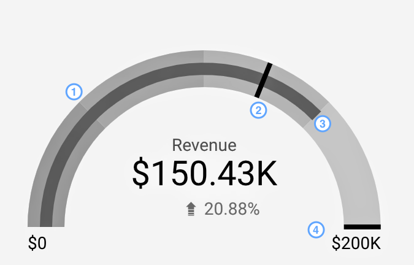
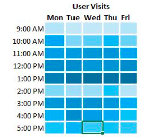

# Visualizations and charts

1. **Gauge chart**

- This chart requires a Value which can be a aggregare for particular period or a current value...etc., a min and max limit.

2. **Grid chart**


- A Grid charts must have two dimensions and one measure.
- The dimensions represent the axis and measure values is a value corresponding to each pair of dimensions.
- A Query selecting the value, dim1, dim2 and Then grouping on (dim1,dim2) and applying desired agg/selection on the value would work.
- For e.g.
```clickhouse
SELECT COUNT(visitor_id) AS val, day,time FROM visitors GROUP BY day,time_hr
```
3. **topN**
- This will retrive top N entries present based on particular field, for particular output.
- A generalized topN function requires:
  1. N - no. of values
  2. table
  3. orderBy - Field on which 
  4. order - ASC or DESC.
4. **Histogram**
- 